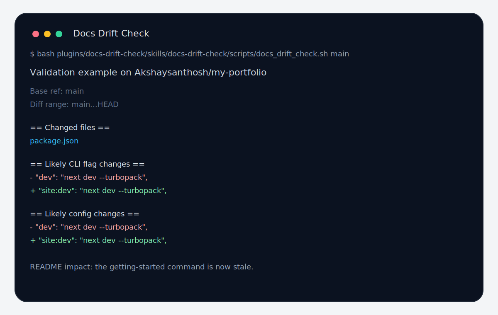

# Docs Drift Check

`docs-drift-check` is a Codex skill and local Codex plugin for spotting likely documentation drift in a branch, PR, or local diff.

Public repository: [github.com/Akshaysanthosh/docs-drift-check](https://github.com/Akshaysanthosh/docs-drift-check)



It focuses on high-signal, user-facing changes such as:

- env vars
- CLI flags and commands
- API routes or endpoints
- config keys
- renamed files or modules
- setup and onboarding steps

## What this repo contains

- A repo-local Codex skill at `.agents/skills/docs-drift-check/`
- A local Codex plugin at `plugins/docs-drift-check/`
- A deterministic helper script for scanning git diffs
- Local installers for the skill and the plugin
- Smoke tests for both installation paths

## Repository layout

```text
.agents/skills/docs-drift-check/
  SKILL.md
  agents/openai.yaml
  references/heuristics.md
  scripts/docs_drift_check.sh
assets/docs-drift-demo.svg
docs/go-to-market.md
docs/validation-report.md
docs/validation/
plugins/docs-drift-check/
  .codex-plugin/plugin.json
  skills/docs-drift-check/
scripts/install_local_skill.sh
scripts/install_local_plugin.sh
scripts/run_public_validation.sh
tests/smoke_test.sh
tests/plugin_smoke_test.sh
```

## Quick start

This repository is the source of truth for both the raw skill and the packaged local plugin.

### Option 1: install the repo-local skill

To use just the skill in another codebase:

```bash
bash scripts/install_local_skill.sh /path/to/target-repo
```

Then, inside the target repo:

```bash
bash .agents/skills/docs-drift-check/scripts/docs_drift_check.sh main
```

Or invoke it in Codex with:

```text
Use $docs-drift-check to assess whether this branch likely needs documentation updates.
```

### Option 2: install the local plugin

To package the skill as a local Codex plugin in another repository:

```bash
bash scripts/install_local_plugin.sh /path/to/target-repo
```

This copies the plugin into `plugins/docs-drift-check/` and creates or updates `.agents/plugins/marketplace.json`.

## Install behavior

- The installer copies `.agents/skills/docs-drift-check/` into the target repository.
- The plugin installer copies `plugins/docs-drift-check/` into the target repository and adds a repo marketplace entry.
- It refuses to overwrite an existing installation unless you pass `--force`.
- Both installers warn if the target directory is not a git repository yet.

## Development

Run the smoke tests locally:

```bash
bash tests/smoke_test.sh
bash tests/plugin_smoke_test.sh
bash scripts/run_public_validation.sh
```

The tests create temporary git repos, install either the skill or the plugin, make docs-sensitive code changes, and verify that the helper script reports the expected signals.

## Public validation

This repo also includes a repeatable validation pass against real public repositories.

- Run it with `bash scripts/run_public_validation.sh`
- Summary report: [docs/validation-report.md](docs/validation-report.md)
- Raw outputs: [my-portfolio](docs/validation/my-portfolio.txt), [Relam-homepage](docs/validation/Relam-homepage.txt), [dara-lab](docs/validation/dara-lab.txt), [gcn-repo](docs/validation/gcn-repo.txt), [relam-landing](docs/validation/relam-landing.txt)

The validation examples use small, intentional branch changes on real public repos so the output stays reproducible and honest.

## License

This project is available under the MIT license. See [LICENSE](LICENSE).

## Commercialization

A lightweight go-to-market plan lives at [docs/go-to-market.md](docs/go-to-market.md).

## Codex marketplace status

The current publish-readiness checklist for the official Codex Plugin Directory lives at [docs/codex-market-publish-checklist.md](docs/codex-market-publish-checklist.md).

## Next steps

Good follow-ups from here:

- improve the heuristics on real PRs
- add language-specific route or config patterns if you see repeatable gaps
- add plugin icons, screenshots, and fuller marketplace metadata
